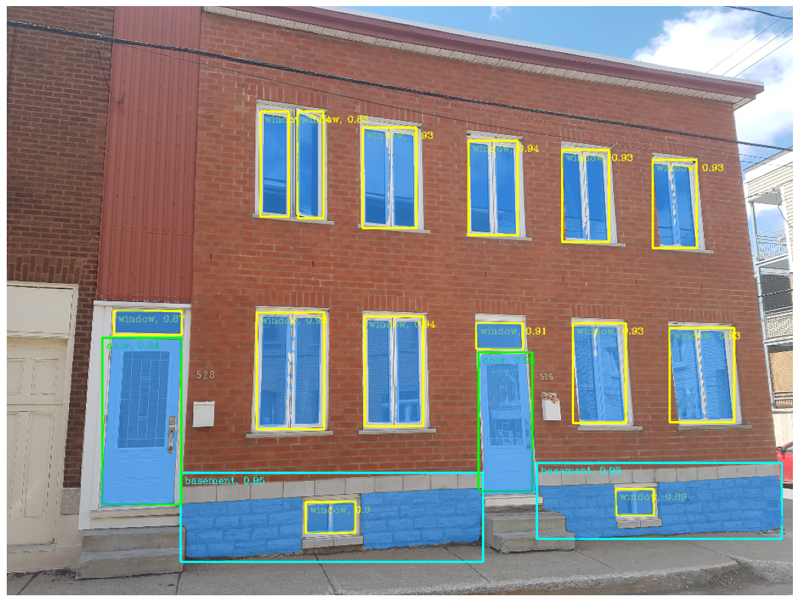

# Detection-of-low-facade-openings-using-YOLOv8-and-SAM
Le présent travail est développé dans le cadre de mon projet de fin d'études au centre de recherche en données et intelligence géospatiale à l'université Laval, pour l'obtention de diplôme d'ingénieur d'état en topographie à l'Institut Agronomique et Vétérinaire Hassan 2. Il consiste à la détection des ouvertures des façades des bâtiments en quatre classes : 'Window', 'Door', 'Basement' et 'Garage' en utilisant YOLOv8 pour la détection d'objets et SAM pour la segmentation. 

[modèle entrainé YOLOv8s sur la classe fenetre](https://drive.google.com/file/d/1_s0H9AkNPFYKLdc2pnOvazdOfwi1e0F3/view?usp=drive_link)
